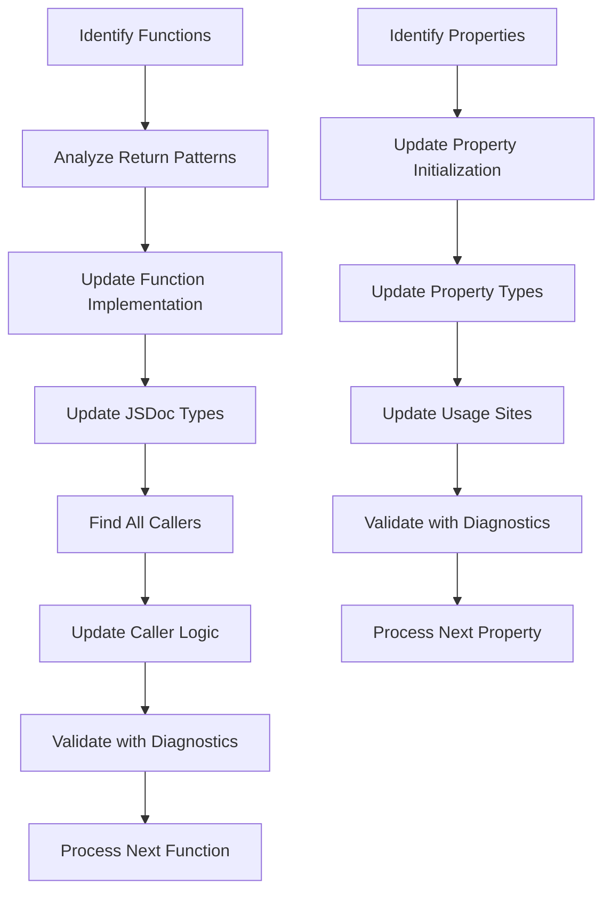

# Design Document

## Overview

This design outlines a systematic approach to replace `null` values with `undefined` across the Convenient Discussions codebase. The refactoring will improve consistency, align with modern JavaScript practices, and maintain strict type safety throughout the process.

Based on codebase analysis, approximately 50+ direct `return null;` statements and 30+ property/variable `null` assignments need to be addressed across the source files, excluding the Tribute library and settings.js which are explicitly exempted.

## Architecture

### Refactoring Strategy

The refactoring follows a dependency-aware approach:

1. **Bottom-up Processing**: Start with leaf functions (those that don't call other internal functions) and work up the call chain
2. **Type Propagation**: Update JSDoc types immediately after code changes to maintain type consistency
3. **Validation at Each Step**: Use TypeScript diagnostics to catch type errors before proceeding
4. **Incremental Commits**: Process files in logical groups to enable rollback if issues arise

### Processing Pipeline



## Components and Interfaces

### Core Processing Components

#### 1. Function Return Value Processor
- **Purpose**: Handle functions that return `null` directly
- **Input**: Function definitions with `return null;`
- **Output**: Functions returning `undefined` with updated JSDoc
- **Logic**:
  - Replace `return null;` with `return;`
  - Add `|| undefined` for native API returns
  - Update `@returns` JSDoc tags

#### 2. Property Assignment Processor
- **Purpose**: Handle property and variable assignments
- **Input**: Properties/variables assigned `null`
- **Output**: Properties using `undefined` with updated types
- **Logic**:
  - Remove `= null` assignments (let default to `undefined`)
  - Update JSDoc from `?Type` to `Type | undefined`
  - Update from `Type | null` to `Type | undefined`

#### 3. Comparison Update Processor
- **Purpose**: Update null comparisons to undefined comparisons
- **Input**: Code comparing values to `null`
- **Output**: Code comparing values to `undefined`
- **Logic**:
  - Replace `=== null` with `=== undefined`
  - Replace `!== null` with `!== undefined`
  - Replace `== null` with `== undefined`
  - Replace `!= null` with `!= undefined`

#### 4. Call Chain Propagation Processor
- **Purpose**: Propagate changes through function call hierarchies
- **Input**: Functions whose return types changed
- **Output**: Updated caller functions and their types
- **Logic**:
  - Find all callers using grep search
  - Update caller return types if they pass through the value
  - Update caller comparisons and logic

## Data Models

### File Processing State
```typescript
interface FileProcessingState {
  filePath: string;
  functionsProcessed: string[];
  propertiesProcessed: string[];
  comparisonsUpdated: number;
  hasErrors: boolean;
  dependentFiles: string[];
}
```

### Function Analysis Result
```typescript
interface FunctionAnalysis {
  name: string;
  filePath: string;
  returnType: 'null' | 'undefined' | 'mixed' | 'other';
  hasDirectNullReturn: boolean;
  hasApiNullReturn: boolean;
  callers: Array<{
    filePath: string;
    functionName: string;
    usageType: 'return' | 'comparison' | 'assignment';
  }>;
}
```

### Property Analysis Result
```typescript
interface PropertyAnalysis {
  name: string;
  filePath: string;
  className?: string;
  currentType: string;
  hasNullAssignment: boolean;
  usageSites: Array<{
    filePath: string;
    lineNumber: number;
    usageType: 'comparison' | 'assignment' | 'access';
  }>;
}
```

## Error Handling

### Type Safety Validation
- Run `getDiagnostics` after each file modification
- Halt processing if new type errors are introduced
- Provide clear error messages with file and line information
- Maintain rollback capability for problematic changes

### Exception Handling
- **Native API Preservation**: Skip `null` values from `mw.*` and native JavaScript APIs
- **Settings Exemption**: Leave settings.js `null` values unchanged
- **Tribute Library Exemption**: Skip all files in `src/tribute/` directory
- **Mixed Type Functions**: Skip functions that can meaningfully return both `null` and `undefined`

### Error Recovery
- Log all changes for potential rollback
- Validate each file independently before moving to dependents
- Provide detailed error reporting for manual intervention

## Testing Strategy

### Validation Approach
1. **Static Type Checking**: Use TypeScript diagnostics throughout the process
2. **Incremental Validation**: Test each file after modification
3. **Regression Prevention**: Ensure no new type errors are introduced
4. **Call Chain Validation**: Verify that function call chains remain consistent

### Test Categories
- **Unit-level**: Individual function return value changes
- **Integration-level**: Function call chain propagation
- **System-level**: Overall codebase type consistency

### Validation Tools
- TypeScript compiler diagnostics via `getDiagnostics`
- ESLint null/undefined consistency rules
- Manual spot-checking of critical code paths

## Implementation Phases

### Phase 1: Analysis and Planning
1. Scan codebase for all `return null;` statements
2. Identify all `= null;` assignments
3. Map function call dependencies
4. Create processing order based on dependencies

### Phase 2: Core Function Updates
1. Process leaf functions first (no internal dependencies)
2. Update return statements and JSDoc
3. Validate each function individually
4. Move up the dependency chain

### Phase 3: Property and Variable Updates
1. Update class property initializations
2. Update local variable assignments
3. Update JSDoc type annotations
4. Validate property access patterns

### Phase 4: Comparison and Usage Updates
1. Update null comparisons to undefined comparisons
2. Update conditional logic
3. Update parameter type checking
4. Validate logical consistency

### Phase 5: Call Chain Propagation
1. Process function callers
2. Update caller return types
3. Update caller comparison logic
4. Validate end-to-end call chains

### Phase 6: Final Validation
1. Run comprehensive type checking
2. Verify no regressions introduced
3. Validate critical code paths
4. Document any remaining exceptions

## Risk Mitigation

### High-Risk Areas
- Functions with complex call chains
- Properties used in multiple contexts
- Code interfacing with external APIs
- Legacy code with unclear semantics

### Mitigation Strategies
- Process high-risk areas manually
- Maintain detailed change logs
- Use incremental validation
- Preserve original behavior for edge cases

### Rollback Plan
- Git-based rollback for file-level changes
- Detailed change documentation for selective rollback
- Type error detection for early problem identification